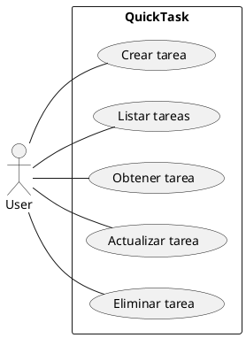
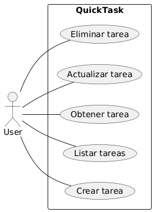
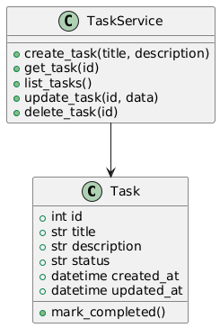

## 1) Requerimientos (funcionales y no funcionales)

### Descripción general
**QuickTask** es una API REST simple que permite crear, listar, actualizar y borrar tareas personales.  
Cada tarea tiene: `id`, `título`, `descripción`, `estado` (`pending` / `completed`) y `timestamps`.

---

### Actores
- **Usuario:** consume la API vía HTTP / curl / frontend mínimo  
- **Sistema:** API backend, persistencia

---

### Requerimientos funcionales
- **Crear tarea:** `POST /tasks` con `title` y `description` → devuelve tarea creada con `id` y `status = "pending"`.
- **Listar tareas:** `GET /tasks` → lista todas las tareas.
- **Obtener tarea:** `GET /tasks/{id}` → devuelve tarea por id o 404.
- **Actualizar tarea:** `PUT /tasks/{id}` o `PATCH /tasks/{id}` → actualizar título, descripción o estado.
- **Eliminar tarea:** `DELETE /tasks/{id}` → 204 si fue eliminada.
- **Marcar como completada:** actualizar `status` a `completed`.
- **Persistencia local:** en SQLite (`quicktask.db`).

---

### Requerimientos no funcionales
- Respuesta en formato **JSON**.  
- Latencia aceptable para propósito educativo (<200ms típico en localhost).  
- Documentación mínima (OpenAPI / autodoc de FastAPI).  
- Seguridad básica: no se implementa auth (MVP), pero los endpoints deben validar entrada y evitar inyección.  
- Tests automatizados con **pytest**.

---

### Criterios de aceptación (3 funciones)
1. **Crear tarea:** dada una petición válida, devolver `201` y la tarea persistida (verificable vía `GET`).  
2. **Listar tareas:** después de crear *N* tareas, `GET /tasks` devuelve *N* items.  
3. **Eliminar tarea:** después de eliminar, `GET /tasks/{id}` debe retornar `404`.

---

### Suposiciones y restricciones
- App monocliente (no multi-tenant).  
- SQLite suficiente para el taller.  
- No autenticación por simplicidad del MVP.  
- El esquema puede extenderse (user, tags) después.

---

### Riesgos / Ambigüedades
- Escrituras concurrentes con SQLite en producción pueden causar bloqueos.  
- Falta autenticación; riesgo si se expone públicamente.  
- Validar límites de tamaño de campos (no definido).

---

## 2) Análisis funcional y técnico (sugerencia de arquitectura)

### Resumen funcional
API REST simple con capa de persistencia y validación.  
UI no requerida (CLI o tiny frontend opcional).

---

### Módulos
- `main.py` → FastAPI app + rutas  
- `models.py` → SQLAlchemy models  
- `schemas.py` → Pydantic schemas  
- `crud.py` → operaciones DB  
- `database.py` → motor y sesión  
- `tests/` → pytest  
- `Dockerfile`, `docker-compose.yml`

---

### Tecnologías recomendadas
- **Lenguaje:** Python 3.11+  
- **Frameworks:** FastAPI, Uvicorn, SQLAlchemy (1.4+), Pydantic, pytest  
- **Base de datos:** SQLite para persistencia local  

---

### Riesgos técnicos y mitigaciones
- **Concurrencia en SQLite:** usar solo en desarrollo; para producción migrar a PostgreSQL.  
- **Validación insuficiente:** reforzar con tests y Pydantic.  
- **Inyección SQL:** prevenir mediante uso de ORM.

---

### Justificación
FastAPI es rápido de levantar, ofrece documentación automática (OpenAPI), y SQLAlchemy/Pydantic están bien integrados.

---

## 3) Diagramas UML (PlantUML)

### Diagrama de Casos de Uso







### Diagrama de Clases
```
@startuml
class Task {
  +int id
  +str title
  +str description
  +str status
  +datetime created_at
  +datetime updated_at
  +mark_completed()
}

class TaskService {
  +create_task(title, description)
  +get_task(id)
  +list_tasks()
  +update_task(id, data)
  +delete_task(id)
}

TaskService --> Task
@enduml
```



## 5) Diseño de base de datos (SQLite) — ER y SQL

Esquema SQL (SQLite)

```sql
CREATE TABLE IF NOT EXISTS tasks (
  id INTEGER PRIMARY KEY AUTOINCREMENT,
  title TEXT NOT NULL,
  description TEXT,
  status TEXT NOT NULL DEFAULT 'pending', -- values: 'pending','completed'
  created_at TEXT NOT NULL DEFAULT (datetime('now')),
  updated_at TEXT NOT NULL DEFAULT (datetime('now'))
);

CREATE INDEX IF NOT EXISTS idx_tasks_status ON tasks(status);

```


## Reflexiones finales

- ¿Lograste una app funcional al primer intento?

    Parcialmente: la API básica y la persistencia funcionaron al primer intento; ajustes en esquemas y manejo de timestamps requirieron 1–2 iteraciones.

- ¿Cuántas veces interviniste para ajustar el código?

    Aproximadamente 2–4 intervenciones (validación, tests, configuración Docker).

- ¿Codeas mejor asistido por IA?

    Sí, la IA acelera prototipado y sugiere enfoques; siempre revisar.

- ¿Con qué IA te sentiste más cómodo?

    ChatGPT para explicaciones y estructuración."